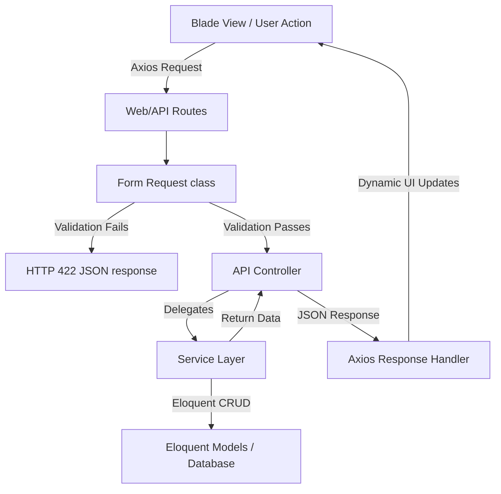

# API & Axios Conversion Plan - Transport Module

This document outlines the architectural plan to convert the Human Resource Management System (HRMS) **Transport Module** into a fully API-first and Axios-based system. It aligns with the Laravel 12 guidelines specified in [GEMINI.md](file:///P:/Project/Web/hrms/GEMINI.md):
- **Thin Controllers** returning JSON responses.
- **Dedicated Request Classes** for input validation.
- **Service Layer** for all business logic (database operations, file uploads, transactions).
- **Blade Template + Axios & Vanilla JS** for asynchronous interaction.

---

## 🗺️ Architectural Pattern Overview



---

## 🏗️ Step-by-Step Conversion Strategy

### Step 1: Create Dedicated Request Classes
Currently, controllers perform inline validation using `$request->validate()`. We will move these to dedicated request files inside `App\Http\Requests\Transport`.

We will create the following request classes:
1. **Route Map**: `StoreRouteMapRequest` & `UpdateRouteMapRequest`
2. **Vehicle**: `StoreVehicleRequest` & `UpdateVehicleRequest`
3. **Vehicle Driver**: `StoreVehicleDriverRequest` & `UpdateVehicleDriverRequest`
4. **Vehicle Allocation**: `StoreVehicleAllocationRequest` & `UpdateVehicleAllocationRequest`
5. **Vehicle Requisition**: `StoreVehicleRequisitionRequest` & `UpdateVehicleRequisitionRequest`
6. **Employee Transport**: `StoreEmployeeTransportRequest` & `UpdateEmployeeTransportRequest`

---

### Step 2: Refactor the Service Layer (`App\Services\Transport`)
The business logic, including database operations, file storage/handling, and transactions, will be moved from the controllers to the service layer.
- Ensure all model operations use the `OrganizationScoped` trait.
- Wrap operations in database transactions (`DB::beginTransaction()`, `DB::commit()`, `DB::rollBack()`) to maintain database integrity.
- Extract file uploading logic (such as saving driver licenses or vehicle images) using custom helper services.

---

### Step 3: Refactor Controllers to be "Thin"
Controllers will only:
1. Receive validation-passed DTOs/Requests.
2. Delegate execution to the Service Layer.
3. Return API standard JSON payloads.

*Example structure for a Controller response:*
- **Success Store**: `return response()->json(['success' => true, 'message' => 'Created successfully', 'data' => $record], 201);`
- **Success Update**: `return response()->json(['success' => true, 'message' => 'Updated successfully', 'data' => $record], 200);`
- **Error Handle**: Handled globally by Laravel's Exception Handler, returning `success => false`, or explicitly caught in try-catch returning 400/500 JSON.

---

### Step 4: Convert Frontend to Axios & Vanilla JS
Update the Blade forms and lists to:
1. Intercept standard submit events using `event.preventDefault()`.
2. Gather input fields (using `FormData` for file uploads or JSON payloads for raw data).
3. Send requests via Axios (`axios.post`, `axios.put`, `axios.delete`).
4. **Client-side Error Handling**: Parse validation errors (HTTP 422) and dynamically highlight inputs with `.is-invalid` and append `.invalid-feedback` containing the backend validation messages.
5. Provide premium success/error feedback using dynamic Alert banners or SweetAlert2.

---

## 💻 Concrete Code Templates

### 1. Form Request Template (`StoreVehicleRequest.php`)
```php
<?php

namespace App\Http\Requests\Transport;

use Illuminate\Foundation\Http\FormRequest;

class StoreVehicleRequest extends FormRequest
{
    public function authorize(): bool
    {
        return auth()->check() && auth()->user()->can('employee-transport.create');
    }

    public function rules(): array
    {
        return [
            'vehicle_category' => 'required|in:Car,Bus,Micro Bus,Truck,Bike,Van,Airplane,Ship',
            'model_number' => 'required|string|max:255',
            'manufacture_year' => 'required|digits:4|integer|min:1900|max:' . (date('Y') + 1),
            'fuel_type' => 'required|in:Petrol,Diesel,CNG,Electric',
            'seating_capacity' => 'nullable|integer|min:1|max:500',
            'license_document' => 'nullable|file|mimes:pdf,jpg,jpeg,png|max:5120',
            'vehicle_image' => 'nullable|image|mimes:jpg,jpeg,png,gif|max:5120',
            'ownership_type' => 'required|in:Company-owned,Third-party',
            'third_party_name' => 'nullable|required_if:ownership_type,Third-party|string|max:255',
            'status' => 'required|in:Active,Inactive',
        ];
    }
}
```

### 2. Service Layer Template (`VehicleServices.php`)
```php
<?php

namespace App\Services\Transport;

use App\Models\Transport\Vehicle;
use App\HelperClass;
use Illuminate\Support\Facades\DB;
use Illuminate\Support\Facades\Log;

class VehicleServices
{
    public function createVehicle(array $data, $files = []): Vehicle
    {
        return DB::transaction(function () use ($data, $files) {
            // Handle file uploads
            if (isset($files['license_document'])) {
                $data['license_document'] = HelperClass::file_upload(
                    $files['license_document'], 
                    'transport/vehicles/license_documents'
                );
            }
            if (isset($files['vehicle_image'])) {
                $data['vehicle_image'] = HelperClass::file_upload(
                    $files['vehicle_image'], 
                    'transport/vehicles/vehicle_images'
                );
            }

            // Create record (OrganizationScoped is automatically applied if configured)
            return Vehicle::create($data);
        });
    }
}
```

### 3. Controller Template (`VehicleController.php`)
```php
<?php

namespace App\Http\Controllers\Transport;

use App\Http\Controllers\Controller;
use App\Http\Requests\Transport\StoreVehicleRequest;
use App\Services\Transport\VehicleServices;
use Illuminate\Http\JsonResponse;
use Exception;

class VehicleController extends Controller
{
    protected VehicleServices $vehicleService;

    public function __construct(VehicleServices $vehicleService)
    {
        $this->vehicleService = $vehicleService;
    }

    public function store(StoreVehicleRequest $request): JsonResponse
    {
        try {
            $vehicle = $this->vehicleService->createVehicle(
                $request->validated(),
                $request->allFiles()
            );

            return response()->json([
                'success' => true,
                'message' => 'Vehicle Added Successfully',
                'data' => $vehicle
            ], 201);

        } catch (Exception $e) {
            return response()->json([
                'success' => false,
                'message' => 'Something Went Wrong: ' . $e->getMessage()
            ], 500);
        }
    }
}
```

### 4. Frontend Axios Submit Template (`form.blade.php`)
```javascript
document.getElementById('vehicleForm').addEventListener('submit', function (e) {
    e.preventDefault();

    const form = this;
    const formData = new FormData(form);
    const submitBtn = form.querySelector('[type="submit"]');
    
    // Clear previous errors
    form.querySelectorAll('.is-invalid').forEach(el => el.classList.remove('is-invalid'));
    form.querySelectorAll('.invalid-feedback').forEach(el => el.remove());
    
    submitBtn.disabled = true;

    axios.post(form.action, formData)
        .then(response => {
            // Show premium success toast / redirect
            Swal.fire({
                icon: 'success',
                title: 'Success!',
                text: response.data.message,
                timer: 1500,
                showConfirmButton: false
            }).then(() => {
                window.location.href = "{{ route('transport.vehicles.index') }}";
            });
        })
        .catch(error => {
            submitBtn.disabled = false;
            
            if (error.response && error.response.status === 422) {
                const errors = error.response.data.errors;
                Object.keys(errors).forEach(key => {
                    const input = form.querySelector(`[name="${key}"]`) || form.querySelector(`[name="${key}[]"]`);
                    if (input) {
                        input.classList.add('is-invalid');
                        
                        // Append error message
                        const feedback = document.createElement('div');
                        feedback.className = 'invalid-feedback';
                        feedback.innerText = errors[key][0];
                        input.parentNode.appendChild(feedback);
                    }
                });
            } else {
                Swal.fire({
                    icon: 'error',
                    title: 'Error',
                    text: error.response?.data?.message || 'Something went wrong.'
                });
            }
        });
});
```

---

## 📈 Timeline & Phase Breakdown

| Phase | Tasks | Estimated Complexity |
|---|---|---|
| **Phase 1** | Implement dedicated Form Requests for all 6 submodules | Low |
| **Phase 2** | Refactor/Split `TransportService` into modular service files | Medium |
| **Phase 3** | Convert Controllers (`store`, `update`, `destroy`) to return JSON | Medium |
| **Phase 4** | Refactor Blade Form submissions to Axios with validation outlines | High |
| **Phase 5** | Run and align feature tests with the new JSON/Axios responses | Medium |
