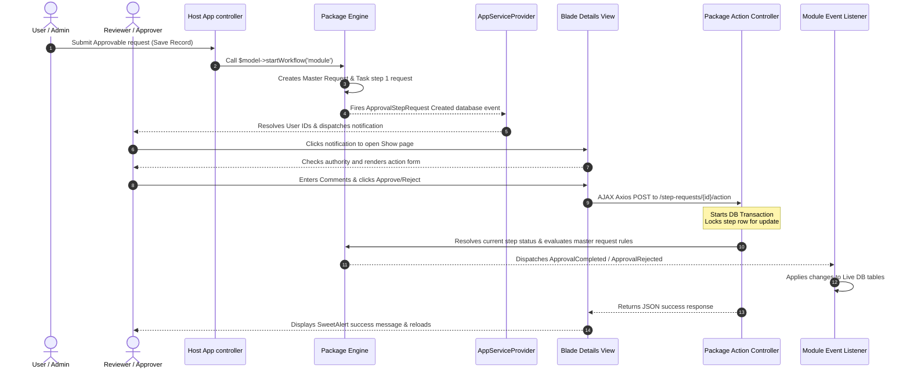

# Laravel Approval Engine - Comprehensive Tutorial & Functional Guide

This document serves as a complete developer guide and implementation tutorial for the **`laravel-approval-engine`** package. It details package architecture, database schemas, step-by-step installation/integration instructions, and structural flows, so developers can implement it without needing to inspect vendor source code.

---

## 🏗️ 1. Architecture & Design Principles

The `laravel-approval-engine` is built on a clean **Domain-Driven Design (DDD)** approach that decouples workflow rules (timeline, sequential order, status resolution) from the host application's business rules (user types, departments, and entity mutations).

### Decoupling Pattern
```
+-----------------------------------+        +-----------------------------------+
|       Host App (HRMS Domain)      |        |     laravel-approval-engine       |
+-----------------------------------+        +-----------------------------------+
|  - Users, Roles, Departments      |        |  - Workflows & Workflow Steps     |
|  - App Models (Promotion, Leave)   |        |  - Approval requests & step logs  |
|  - Approver resolver implementation| <====> |  - Routing triggers & algorithms  |
|  - Final side-effect listeners    |        |  - Global events dispatcher       |
+-----------------------------------+        +-----------------------------------+
```

---

## 📦 2. What is Inside the Package?

### A. Database Models & Schema Blueprint
The package manages workflow state using four database tables:

1. **`Workflow` (`approval_workflows` table)**:
   * **Role:** The configuration blueprint for a module's workflow.
   * **Attributes:**
     * `id` (Primary Key)
     * `name` (string): Human-readable name.
     * `module` (string): Unique identifier matching the host app module (e.g. `'leave'`, `'promotion'`).
     * `type` (enum): `'sequential'` (runs in strict order) or `'random'` (approvers can act simultaneously).
     * `total_steps` (integer): Total number of approvals required.
     * `required_approvals` (integer, nullable): Number of approvals required for random workflows.
     * `is_active` (boolean): Whether this blueprint is active.
     * `includer_user_types` (JSON, nullable): Allowed user types for inclusion scope (e.g. `['division', 'department']`).
     * `includer_role_ids` (JSON, nullable): Allowed Spatie Role IDs for inclusion scope.
     * `includer_user_ids` (JSON, nullable): Allowed User IDs for inclusion scope.
     * `exclude_user_types` (JSON, nullable): User types to bypass approval (auto-approve).
     * `exclude_role_ids` (JSON, nullable): Spatie Role IDs to bypass approval (auto-approve).
     * `exclude_user_ids` (JSON, nullable): User IDs to bypass approval (auto-approve).

2. **`WorkflowStep` (`approval_workflow_steps` table)**:
   * **Role:** The individual approval levels/tiers within a workflow.
   * **Attributes:**
     * `id` (Primary Key)
     * `workflow_id` (Foreign Key to `approval_workflows`)
     * `name` (string): Description of the step (e.g., `'HR Approval'`).
     * `step_order` (integer): Order of execution (1, 2, 3...).
     * `required_user_type` (string, nullable): Targets structural user roles (e.g., `'department'`).
     * `role_id` (integer, nullable): Targets a specific Spatie Role ID.
     * `user_id` (integer, nullable): Targets a specific User ID.

3. **`ApprovalRequest` (`approval_requests` table)**:
   * **Role:** The master transaction tracker for a specific model's approval process.
   * **Attributes:**
     * `id` (Primary Key)
     * `workflow_id` (Foreign Key to `approval_workflows`)
     * `approvable_type` (string): Polymorphic model class (e.g., `App\Models\Payroll\Promotion`).
     * `approvable_id` (integer): Polymorphic model ID.
     * `status` (enum): `'pending'`, `'approved'`, `'rejected'`.

4. **`ApprovalStepRequest` (`approval_step_requests` table)**:
   * **Role:** The active tokens or tasks emitted for review.
   * **Attributes:**
     * `id` (Primary Key)
     * `approval_request_id` (Foreign Key to `approval_requests`)
     * `workflow_step_id` (Foreign Key to `approval_workflow_steps`)
     * `approver_id` (integer, nullable): User ID of the reviewer who took action.
     * `status` (enum): `'pending'`, `'approved'`, `'rejected'`.
     * `comments` (text, nullable): Remarks left by the reviewer.
     * `action_taken_at` (timestamp, nullable): Timestamp of the decision.

---

### B. Core Services
* **`WorkflowGenerator`**: Resolves the active blueprint for a module based on creator properties, evaluates **Inclusion** and **Exclusion** rules (auto-approving if excluded or if creator doesn't match defined target inclusions), creates the master `ApprovalRequest`, and ignites the workflow steps.
* **`TaskEmitter`**: Generates `ApprovalStepRequests` (tasks). In sequential mode, it emits one step at a time; in random mode, it emits all steps at once.
* **`ApprovalResolver`**: Processes decisions, updates step records, and evaluates the master request for final approval/rejection.

---

### C. Package Events
The package fires system-wide events during transition points:

| Event Class | Namespace | Trigger Scenario |
| :--- | :--- | :--- |
| **`ApprovalRequested`** | `Innovity\ApprovalEngine\Events\ApprovalRequested` | Fired when a workflow is initiated via `startWorkflow()`. |
| **`ApprovalStepApproved`** | `Innovity\ApprovalEngine\Events\ApprovalStepApproved` | Fired when an individual step request is approved by a reviewer. |
| **`ApprovalCompleted`** | `Innovity\ApprovalEngine\Events\ApprovalCompleted` | Fired when all blueprint steps are satisfied (overall workflow success). |
| **`ApprovalRejected`** | `Innovity\ApprovalEngine\Events\ApprovalRejected` | Fired when a step rejection fails the workflow (overall workflow failure). |

---

### D. Package Routes & Controllers
The package self-handles API routing:
* **Workflow Configuration API:** `Route::apiResource('workflows', WorkflowConfigController::class)`
* **Decision Action Endpoint:** `Route::post('step-requests/{id}/action', [ApprovalActionController::class, 'action'])`
  * Includes transaction safety (`DB::transaction`) and pessimistic row locking (`lockForUpdate`) to prevent race conditions during concurrent requests.

---

## 🛠️ 3. Step-by-Step Host App Integration Tutorial

### Step 1: Install & Publish Assets
Install the package via composer:
```bash
composer require innovity/laravel-approval-engine
```
Publish migration files and configs:
```bash
php artisan vendor:publish --tag=approval-engine-config
php artisan vendor:publish --tag=approval-engine-migrations
php artisan migrate
```

---

### Step 2: Implement the `Approvable` Trait
Attach the trait to any Eloquent model that requires approval workflows.

```php
namespace App\Models\Payroll;

use Illuminate\Database\Eloquent\Model;
use Innovity\ApprovalEngine\Traits\Approvable;

class Promotion extends Model
{
    use Approvable;
    
    // Note: The trait adds a polymorphic relationship: $promotion->approvalRequests
}
```
*Note:* The workflow does not start automatically on save. You must explicitly start it when the record is ready:
```php
$promotion->startWorkflow('promotion');
```

---

### Step 3: Create the Approver Resolver
The engine needs the host application to determine *which* specific user IDs are authorized to resolve a step order. Implement `ApproverResolverInterface` in your application:

```php
namespace App\Services;

use Innovity\ApprovalEngine\Contracts\ApproverResolverInterface;

class ApproverResolver implements ApproverResolverInterface
{
    public function resolve(string $stepId, $approvable): array
    {
        // 1. Fetch step details
        $step = \Innovity\ApprovalEngine\Models\WorkflowStep::find($stepId);
        
        // 2. Resolve users based on structural types, Spatie roles, or user IDs
        if ($step->type === 'user-type') {
            return \App\Models\User::withoutGlobalScopes()
                ->where('user_type', $step->required_user_type)
                ->where('current_department_id', $approvable->employee->current_department_id)
                ->pluck('id')
                ->toArray();
        }
        
        return [];
    }
}
```
Bind the interface in [AppServiceProvider.php](file:///P:/Project/Web/hrms/app/Providers/AppServiceProvider.php):
```php
public function register(): void
{
    $this->app->bind(
        \Innovity\ApprovalEngine\Contracts\ApproverResolverInterface::class,
        \App\Services\ApproverResolver::class
    );
}
```

---

### Step 4: Register Decoupled Event Listeners
Instead of placing all post-approval database mutations in a single, bloated listener, write separate listeners for each module and dynamically route them in your provider.

#### 1. Implement Module-Specific Listeners
Create dedicated listeners under `app/Listeners/Workflow/`:

```php
// app/Listeners/Workflow/LeaveWorkflowListener.php
namespace App\Listeners\Workflow;

use Innovity\ApprovalEngine\Events\ApprovalCompleted;
use Innovity\ApprovalEngine\Events\ApprovalRejected;
use App\Models\Leave\Leave;

class LeaveWorkflowListener
{
    public function handleCompleted(ApprovalCompleted $event): void
    {
        $leave = $event->approvalRequest->approvable;
        if ($leave instanceof Leave) {
            $leave->update(['status' => 'approved']);
            // Deduct leave balances, write audit logs...
        }
    }

    public function handleRejected(ApprovalRejected $event): void
    {
        $leave = $event->approvalRequest->approvable;
        if ($leave instanceof Leave) {
            $leave->update(['status' => 'rejected']);
        }
    }
}
```

#### 2. Declare Map & Register Listeners in Service Provider
In [AppServiceProvider.php](file:///P:/Project/Web/hrms/app/Providers/AppServiceProvider.php), declare your registry mapping array and bind closures inside the `boot()` method:

```php
class AppServiceProvider extends ServiceProvider
{
    // Registry Map
    private array $workflowListeners = [
        'leave'              => \App\Listeners\Workflow\LeaveWorkflowListener::class,
        'promotion'          => \App\Listeners\Workflow\PromotionWorkflowListener::class,
        'office-information' => \App\Listeners\Workflow\ProfileUpdateWorkflowListener::class,
    ];

    public function boot(): void
    {
        // Intercept completed workflows and route to matching listener
        \Illuminate\Support\Facades\Event::listen(ApprovalCompleted::class, function (ApprovalCompleted $event) {
            $module = $event->approvalRequest->workflow->module;
            if (isset($this->workflowListeners[$module])) {
                $listener = app($this->workflowListeners[$module]);
                if (method_exists($listener, 'handleCompleted')) {
                    $listener->handleCompleted($event);
                }
            }
        });

        // Intercept rejected workflows
        \Illuminate\Support\Facades\Event::listen(ApprovalRejected::class, function (ApprovalRejected $event) {
            $module = $event->approvalRequest->workflow->module;
            if (isset($this->workflowListeners[$module])) {
                $listener = app($this->workflowListeners[$module]);
                if (method_exists($listener, 'handleRejected')) {
                    $listener->handleRejected($event);
                }
            }
        });
    }
}
```

---

### Step 5: Implement UI Action Confirmation (SweetAlert2 + Axios)
Integrate dynamic action confirmation popups on the frontend. When a reviewer clicks Approve or Reject, catch the event, trigger SweetAlert2, and submit using Axios:

```html
<!-- action form component -->
<form id="approvalForm" action="{{ route('approval.action', $pendingStep->id) }}" method="POST">
    @csrf
    <input type="hidden" name="action" id="actionInput" value="">
    <textarea name="comments" id="comments" required placeholder="Remarks..."></textarea>
    
    <button type="button" id="btnApprove">Approve</button>
    <button type="button" id="btnReject">Reject</button>
</form>

<script>
document.getElementById('btnApprove').addEventListener('click', function(e) {
    e.preventDefault();
    confirmAction('approve', 'Are you sure you want to approve this request?');
});

function confirmAction(actionType, messageText) {
    const form = document.getElementById('approvalForm');
    
    Swal.fire({
        title: messageText,
        text: "You won't be able to revert this!",
        icon: 'warning',
        showCancelButton: true,
        confirmButtonColor: '#3085d6',
        cancelButtonColor: '#d33',
        confirmButtonText: 'Confirm'
    }).then((result) => {
        if (result.isConfirmed) {
            document.getElementById('actionInput').value = actionType;
            
            axios.post(form.getAttribute('action'), new FormData(form))
                .then(response => {
                    Swal.fire('Success!', response.data.message, 'success').then(() => {
                        window.location.reload();
                    });
                })
                .catch(error => {
                    Swal.fire('Error!', error.response?.data?.message || error.message, 'error');
                });
        }
    });
}
</script>
```

---

## 📈 4. Sequence & Data Flow Visualizations

### End-to-End Approval Lifecycle Flow


---

## 🔍 5. Requesting User & Auto-Approvals

### A. How the Package Resolves the Requesting User
The vendor package determines who the requesting user is by resolving the **`creator`** property on the approvable model.

Inside the package's `WorkflowGenerator.php` (line 17), it resolves the creator object as follows:
```php
$creator = $approvable->creator 
    ?? (method_exists($approvable, 'creator') ? $approvable->creator()->first() : null);
```

#### Userstamps Integration
Because all models in the host application are configured to use the `Userstamps` trait, the `creator` relationship is resolved from the `created_by` column:
```php
public function creator()
{
    return $this->belongsTo(\App\Models\User::class, 'created_by');
}
```
During workflow evaluations, the engine uses this resolved `$creator` model to check user types, roles, and ID-based criteria.

---

### B. Auto-Approval Mechanism
Auto-approvals are split into two categories:

#### 1. Workflow Bypass (Package Level)
* **Description**: If the user who created the request (e.g., a Super Admin) is explicitly bypassed from workflow rules.
* **Handled by**: **The vendor package** (`innovity/laravel-approval-engine`).
* **Implementation**: Inside `WorkflowGenerator::generate()`, the package checks the workflow's configured exclusions (`exclude_role_ids`, `exclude_user_types`, `exclude_user_ids`). If matched, it sets the `ApprovalRequest` status to `approved` instantly without generating any step requests.

#### 2. Authority & Self-Approver Auto-Approval (Host App Level)
* **Description**: If step requests are generated, but the requester has a higher authority level or is their own step's approver.
* **Handled by**: **The host application** (`App\Services\Setting\WorkflowStepRequestService.php`).
* **Implementation**: Intercepted dynamically via Eloquent's model creation event.
  * **Self-Approval**: Checks if the creator's ID matches the resolved approvers for the step. If so, it approves the step automatically.
  * **Authority-Based**: Compares the weight of the creator's `user_type` against the step's `required_user_type`. If the creator has a higher authority level (strictly lower weight value, e.g. `Group` (0) < `Company` (1)), it auto-approves the step.

