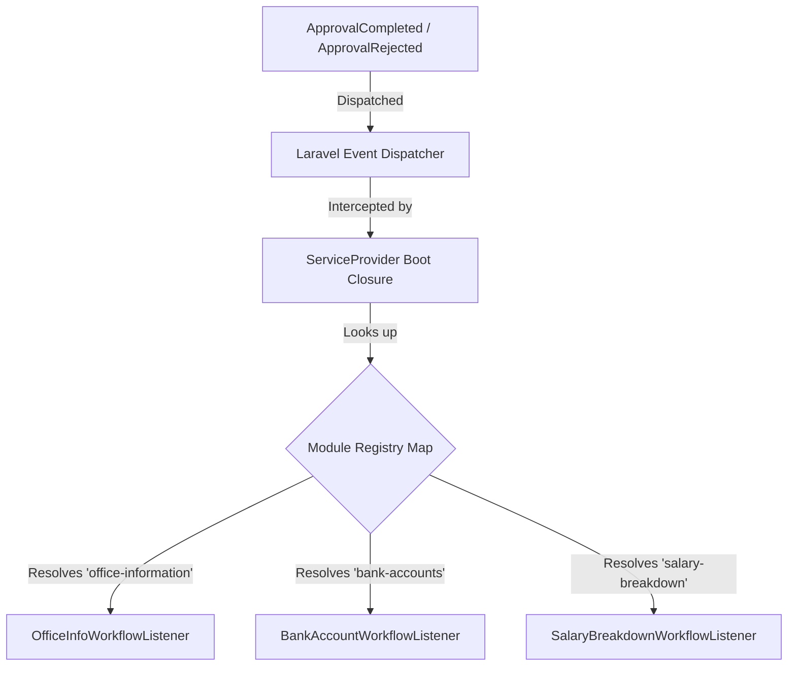

# Decoupled Workflow Event Listeners Plan

This plan outlines how to refactor the monolithic `WorkflowStatusListener` into separate, module-specific listeners (e.g., `OfficeInfoListener`, `BankAccountListener`) and map them dynamically within the `boot` function of a Service Provider.

---

## 🏗️ Design Architecture



---

## 📋 The Implementation Plan

### Step 1: Create a Custom Service Provider (or use `AppServiceProvider`)
We will define a map of modules to their dedicated listeners, then register routing callbacks inside the provider's `boot()` method.

*   **Create Service Provider:** `app/Providers/WorkflowServiceProvider.php`
*   **Implementation:**
```php
<?php

namespace App\Providers;

use Illuminate\Support\ServiceProvider;
use Illuminate\Support\Facades\Event;
use Innovity\ApprovalEngine\Events\ApprovalCompleted;
use Innovity\ApprovalEngine\Events\ApprovalRejected;

class WorkflowServiceProvider extends ServiceProvider
{
    /**
     * Map of modules to their dedicated listener classes.
     */
    protected array $moduleListeners = [
        'general' => \App\Listeners\Workflow\GeneralWorkflowListener::class,
        'office-information' => \App\Listeners\Workflow\OfficeInfoWorkflowListener::class,
        'bank-accounts' => \App\Listeners\Workflow\BankAccountWorkflowListener::class,
        'salary-breakdown' => \App\Listeners\Workflow\SalaryBreakdownWorkflowListener::class,
        'policy-tag' => \App\Listeners\Workflow\PolicyTagWorkflowListener::class,
    ];

    public function register(): void
    {
        //
    }

    public function boot(): void
    {
        // 1. Listen for Approval Completed Events
        Event::listen(ApprovalCompleted::class, function (ApprovalCompleted $event) {
            $module = $event->approvalRequest->workflow->module;
            
            if (isset($this->moduleListeners[$module])) {
                $listener = app($this->moduleListeners[$module]);
                if (method_exists($listener, 'handleCompleted')) {
                    $listener->handleCompleted($event);
                }
            }
        });

        // 2. Listen for Approval Rejected Events
        Event::listen(ApprovalRejected::class, function (ApprovalRejected $event) {
            $module = $event->approvalRequest->workflow->module;
            
            if (isset($this->moduleListeners[$module])) {
                $listener = app($this->moduleListeners[$module]);
                if (method_exists($listener, 'handleRejected')) {
                    $listener->handleRejected($event);
                }
            }
        });
    }
}
```

---

### Step 2: Register the Provider (For Laravel 11/12)
Add the provider to `bootstrap/providers.php` so it is loaded by the framework bootstrap.

*   **File Path:** `bootstrap/providers.php`
*   **Register:**
```php
return [
    App\Providers\AppServiceProvider::class,
    App\Providers\WorkflowServiceProvider::class, // Add this line
];
```

---

### Step 3: Implement the Separate Module Listeners
Create the listener classes inside the `app/Listeners/Workflow/` directory. Each class is dedicated solely to its own domain.

#### Example: `OfficeInfoWorkflowListener.php`
*   **File Path:** `app/Listeners/Workflow/OfficeInfoWorkflowListener.php`
```php
<?php

namespace App\Listeners\Workflow;

use Innovity\ApprovalEngine\Events\ApprovalCompleted;
use Innovity\ApprovalEngine\Events\ApprovalRejected;

class OfficeInfoWorkflowListener
{
    public function handleCompleted(ApprovalCompleted $event): void
    {
        $approvable = $event->approvalRequest->approvable;
        
        // 1. Update the request status
        $approvable->update(['status' => 'approved']);
        
        // 2. Perform office-information specific application mutations...
    }

    public function handleRejected(ApprovalRejected $event): void
    {
        $approvable = $event->approvalRequest->approvable;
        
        // Update status to rejected
        $approvable->update(['status' => 'rejected']);
    }
}
```

#### Example: `BankAccountWorkflowListener.php`
*   **File Path:** `app/Listeners/Workflow/BankAccountWorkflowListener.php`
```php
<?php

namespace App\Listeners\Workflow;

use Innovity\ApprovalEngine\Events\ApprovalCompleted;
use Innovity\ApprovalEngine\Events\ApprovalRejected;

class BankAccountWorkflowListener
{
    public function handleCompleted(ApprovalCompleted $event): void
    {
        $approvable = $event->approvalRequest->approvable;
        
        $approvable->update(['status' => 'approved']);
        
        // Perform bank-account specific mutations...
    }

    public function handleRejected(ApprovalRejected $event): void
    {
        $approvable->update(['status' => 'rejected']);
    }
}
```

---

## 💎 Key Benefits of this Design
1. **Single Responsibility Principle (SRP):** Each class only changes when its corresponding module updates.
2. **Open-Closed Principle (OCP):** You can add new modules to the system without modifying existing listeners. You only need to register the new class in the `$moduleListeners` array.
3. **No Bloated Switch Statements:** The Service Provider dynamically resolves and calls the target listener at runtime.
