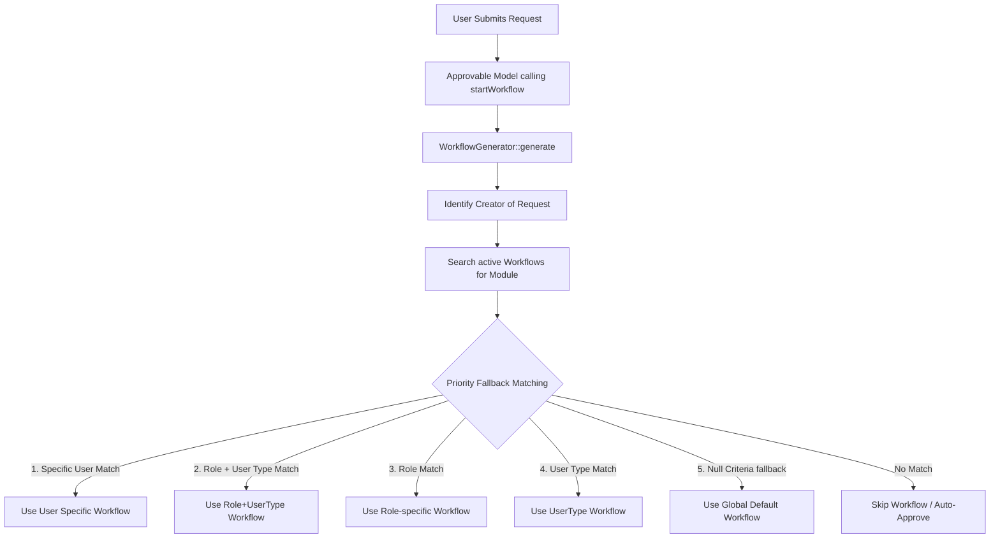

# Requester Criteria Filtering Plan (Innovity Approval Engine)

This plan details how to implement creator-based (requester) filtering criteria in the `innovity/laravel-approval-engine` package and configure it through the HRMS administration interface.

---

## 1. Architectural Flow Diagram



---

## 2. Database Changes (Migration)

Add three nullable columns to the `approval_workflows` table to track the creator criteria.

Create a migration inside the package or in the main application:

```php
Schema::table('approval_workflows', function (Blueprint $table) {
    // Target creator filter criteria
    $table->string('requester_user_type')->nullable()->after('module');
    $table->unsignedBigInteger('requester_role_id')->nullable()->after('requester_user_type');
    $table->unsignedBigInteger('requester_user_id')->nullable()->after('requester_role_id');

    // Add unique composite constraint to prevent redundant workflows
    $table->unique(
        ['module', 'requester_user_type', 'requester_role_id', 'requester_user_id'],
        'module_requester_unique'
    );
});
```

---

## 3. Package Updates

### A. Model Updates (`Innovity\ApprovalEngine\Models\Workflow`)
Expose the new requester fields inside the fillable attributes or cast parameters:

```php
protected $casts = [
    'type' => WorkflowType::class,
    'is_active' => 'boolean',
    'requester_role_id' => 'integer',
    'requester_user_id' => 'integer',
];
```

### B. Logic Updates (`Innovity\ApprovalEngine\Services\WorkflowGenerator`)
Update `generate()` to identify the creator and query matching workflows using a priority fallback chain:

```php
public function generate(Model $approvable, string $module, ?array $payload = null)
{
    // 1. Identify the creator of the request
    $creator = $approvable->creator 
        ?? (method_exists($approvable, 'creator') ? $approvable->creator()->first() : null) 
        ?? auth()->user();

    if (!$creator) {
        // Fall back to a global match if creator is unidentified
        $workflow = Workflow::where('module', $module)
            ->whereNull('requester_user_type')
            ->whereNull('requester_role_id')
            ->whereNull('requester_user_id')
            ->where('is_active', true)
            ->first();
    } else {
        // 2. Fetch all active workflows for this module
        $workflows = Workflow::where('module', $module)
            ->where('is_active', true)
            ->get();

        // 3. Evaluate criteria in order of specificity
        $workflow = $this->resolveWorkflowForCreator($workflows, $creator);
    }

    if (!$workflow) {
        return null; // Skip if no workflow criteria match
    }

    $request = $approvable->approvalRequests()->create([
        'workflow_id' => $workflow->id,
        'payload' => $payload,
        'status' => 'pending',
    ]);

    $this->emitter->emit($request);
    ApprovalRequested::dispatch($request);

    return $request;
}

protected function resolveWorkflowForCreator($workflows, $creator)
{
    // Match 1: Specific User ID
    $match = $workflows->first(fn($w) => $w->requester_user_id == $creator->id);
    if ($match) return $match;

    // Match 2: User Type AND Role ID
    $match = $workflows->first(fn($w) => 
        $w->requester_user_type === $creator->user_type && 
        $w->requester_role_id && 
        $creator->hasRole($w->requester_role_id)
    );
    if ($match) return $match;

    // Match 3: Role ID only
    $match = $workflows->first(fn($w) => 
        $w->requester_role_id && 
        $creator->hasRole($w->requester_role_id) &&
        is_null($w->requester_user_type)
    );
    if ($match) return $match;

    // Match 4: User Type only
    $match = $workflows->first(fn($w) => 
        $w->requester_user_type === $creator->user_type &&
        is_null($w->requester_role_id)
    );
    if ($match) return $match;

    // Match 5: Fallback to global defaults (all criteria null)
    return $workflows->first(fn($w) => 
        is_null($w->requester_user_type) && 
        is_null($w->requester_role_id) && 
        is_null($w->requester_user_id)
    );
}
```

---

## 4. UI Administration Updates

### A. Controller Changes (`App\Http\Controllers\Setting\ApprovalWorkflowController`)
1. **Module Uniqueness**: Modify validation to validate unique composite combinations instead of raw unique on `module`.
2. **Persistence**: Store `requester_user_type`, `requester_role_id`, and `requester_user_id` inside `store()` and `update()`.

```php
$request->validate([
    'module_name' => 'required|string',
    'requester_user_type' => 'nullable|string',
    'requester_role_id' => 'nullable|exists:roles,id',
    'requester_user_id' => 'nullable|exists:users,id',
    // ... other validation
]);
```

### B. Form Changes (`setting/approval_workflow/create.blade.php`)
Add a new **"Creator/Requester Scope Configuration"** card containing selection inputs:

```html
<div class="card mb-4">
    <div class="card-header">
        <h5 class="card-title mb-0">Requester Scope (Who does this apply to?)</h5>
        <small class="text-muted">Leave empty to apply this workflow to all creators/requesters by default.</small>
    </div>
    <div class="card-body">
        <div class="row">
            <!-- Requester Scope Type Toggle -->
            <div class="col-md-3 mb-3">
                <label class="form-label fw-semibold">Target Scope</label>
                <select name="scope_type" id="scope_type" class="form-select">
                    <option value="all">Apply to All (Default)</option>
                    <option value="user_type">User Type</option>
                    <option value="role">User Role</option>
                    <option value="user_type_role">User Type + Role</option>
                    <option value="specific_user">Specific User</option>
                </select>
            </div>

            <!-- User Type Dropdown -->
            <div class="col-md-3 mb-3 scope-field d-none" id="scope_user_type_div">
                <label class="form-label fw-semibold">User Type</label>
                <select name="requester_user_type" class="form-select">
                    <option value="">Select User Type</option>
                    @foreach($userTypes as $type)
                        <option value="{{ $type->value }}">{{ $type->name }}</option>
                    @endforeach
                </select>
            </div>

            <!-- Role Dropdown -->
            <div class="col-md-3 mb-3 scope-field d-none" id="scope_role_div">
                <label class="form-label fw-semibold">User Role</label>
                <select name="requester_role_id" class="form-select">
                    <option value="">Select Role</option>
                    @foreach($roles as $role)
                        <option value="{{ $role->id }}">{{ $role->name }}</option>
                    @endforeach
                </select>
            </div>

            <!-- Specific User Dropdown -->
            <div class="col-md-3 mb-3 scope-field d-none" id="scope_user_div">
                <label class="form-label fw-semibold">Specific User</label>
                <select name="requester_user_id" class="form-select select2">
                    <option value="">Select User</option>
                    @foreach($users as $user)
                        <option value="{{ $user->id }}">{{ $user->name }}</option>
                    @endforeach
                </select>
            </div>
        </div>
    </div>
</div>
```

**Form JavaScript Handler**:
Toggle visibility of the target selection containers depending on the selected `scope_type`:
```javascript
$('#scope_type').on('change', function() {
    $('.scope-field').addClass('d-none').find('select').val('');
    const val = $(this).val();
    if (val === 'user_type') {
        $('#scope_user_type_div').removeClass('d-none');
    } else if (val === 'role') {
        $('#scope_role_div').removeClass('d-none');
    } else if (val === 'user_type_role') {
        $('#scope_user_type_div, #scope_role_div').removeClass('d-none');
    } else if (val === 'specific_user') {
        $('#scope_user_div').removeClass('d-none');
    }
});
```
